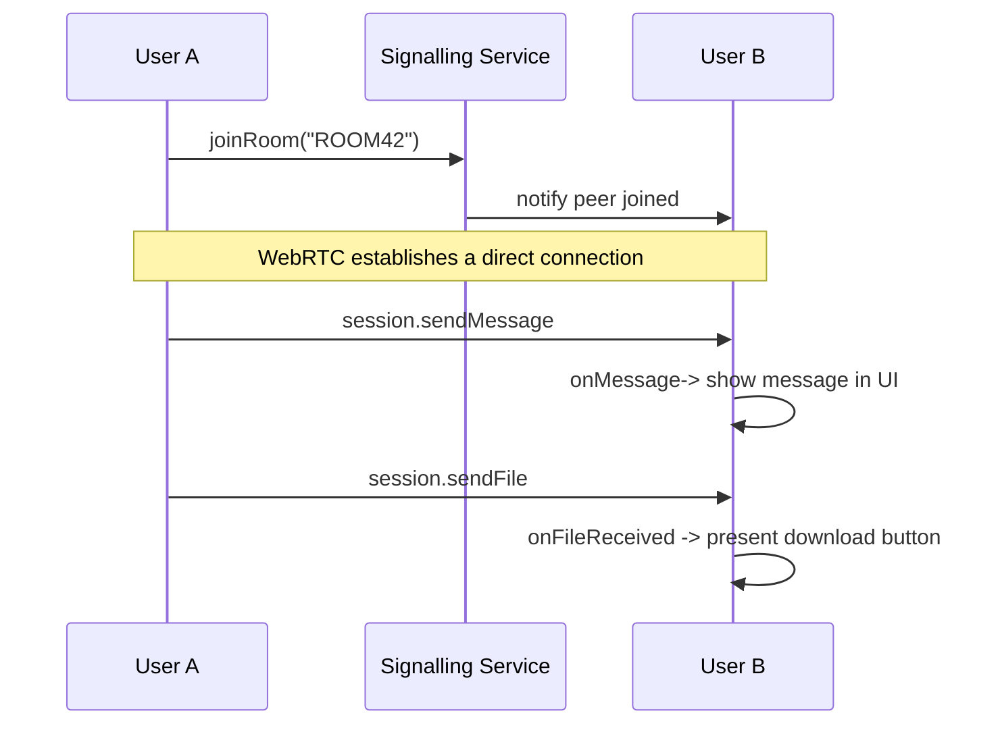

# WebRTC API — Domain-friendly public surface

TL;DR

- Provide a small, business-friendly API to describe room sessions, peer messaging, and file sharing. Names and descriptions below are phrased so a PM or UX designer can read them and understand intent without deep WebRTC knowledge.

Intent (plain language)

- "Join a room": connect two users so they can exchange messages and files directly (peer-to-peer). The server only helps connect them (signalling).
- "Send a message": send short text to the other peer in real time.
- "Share a file": send a file in small pieces so the receiver can stream and download it reliably.

Public API (user-facing names and descriptions)

- `joinRoom(roomCode: string)` — join or create a room session; returns a small session object used by the UI to report `status` and send actions.
- `session.sendMessage(text: string)` — send a chat-style text message to the peer.
- `session.sendFile(file: File)` — send a file to the peer; returns a `fileId` you can use to track progress.
- `onMessage(callback)` — UI hook invoked when a text message arrives.
- `onFileProgress(fileId, percent)` — UI hook for upload/download progress (implementation note: progress comes from chunk acknowledgements / buffer events).
- `onFileReceived(meta)` — UI hook triggered when a file has been fully received and is available for download.

Developer mapping (what these mean technically)

- `joinRoom` → `createWebRTCConnection(roomCode)` in code.
- `session.sendMessage` → `DataChannelAPI.sendText` (`createDataChannelAPI`).
- `session.sendFile` → `DataChannelAPI.sendFile` → `sendChunks` (handles chunking + backpressure).
- `onMessage` → `createDataChannelAPI(...).setOnText`
- `onFileReceived` → code receives `file-start`/binary chunks/`file-end` and runs `handleFileEnd` which calls the download helper.

Expected behaviors & invariants (plain language)

- Messages are validated: the client ignores malformed packets and only acts on well-formed messages.
- File sharing uses a simple lifecycle:
  1. Sender announces file (id, name, size).
  2. Sender streams binary chunks labelled with the same id.
  3. Sender announces file end; receiver assembles and downloads.
- Sending respects network/backpressure: the sender waits when the browser's send buffer is full.
- Multiple files can be sent in parallel; each file has its own id to keep streams separate.

Public flowchart (high-level, PM-friendly)

Why this wording

- PM/UX view: actions are verbs and describe goals: `joinRoom`, `sendMessage`, `sendFile`.
- Technical view: mapping section shows the exact functions to call in code so engineers can implement the UI hooks.

Next step

- If you like this DDD-friendly public API, I'll update `createWebRTCConnection` and `createDataChannelAPI` exports to include the PM-friendly wrapper names (thin adapter functions), and add simple examples in `src/routes/room.tsx` showing how the UI would use them.
